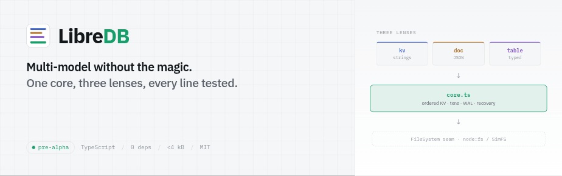
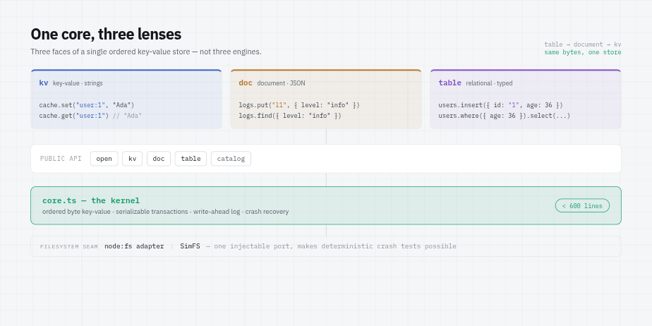
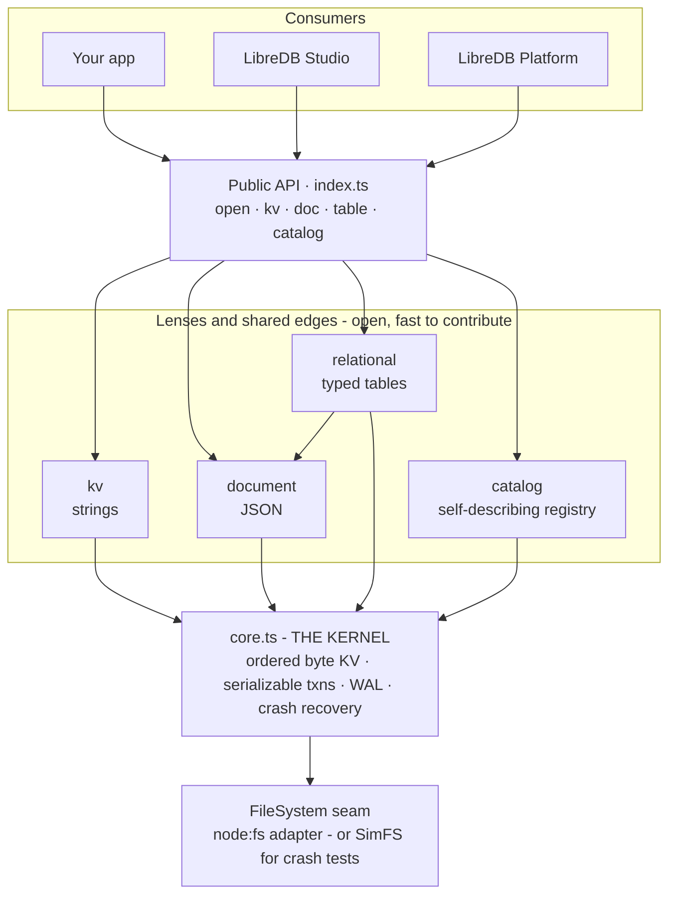
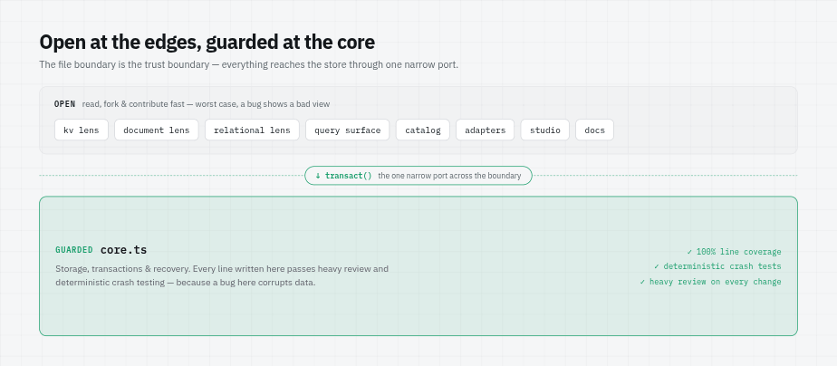
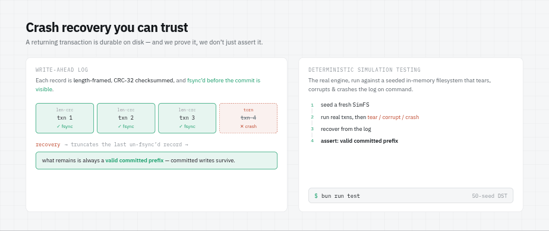
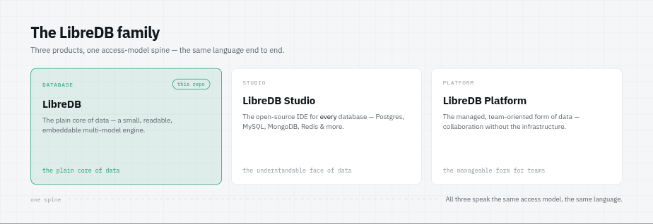

# LibreDB

<picture>
  <source media="(prefers-color-scheme: dark)" srcset="docs/img/01-hero-dark.png">
  
</picture>

**Multi-model without the magic. One core, three lenses, every line tested.**

[](https://www.npmjs.com/package/@libredb/libredb)
[](https://github.com/libredb/libredb-database/actions/workflows/ci.yml)
[](https://sonarcloud.io/summary/new_code?id=libredb_libredb-database)
[](https://sonarcloud.io/summary/new_code?id=libredb_libredb-database)
[](./LICENSE)
[](https://www.typescriptlang.org/)
[](./package.json)
[](https://bundlephobia.com/package/@libredb/libredb)
[](#project-status--roadmap)

LibreDB is a small, readable, embeddable, multi-model database written in TypeScript. It is built on
one idea: a database can be powerful and still be understood by opening its source. A single ordered
key-value core handles durability and transactions; key-value, document, and relational APIs are thin
*lenses* over that one core — not three separate engines. It runs in-memory for tests or file-backed
for durability, ships **zero runtime dependencies**, and proves its crash recovery with deterministic
simulation testing. Today it is pre-alpha, aimed at test and development environments — small enough to
learn how a database actually works, and serious enough to grow into more.

## Highlights

- **One small core, three lenses** — key-value, document, and relational over a single ordered
  key-value engine (FoundationDB-style), not three engines bolted together.
- **Multi-model** — raw strings, JSON documents, and schema-validated typed tables in the same
  database, even the same file.
- **Readable by design** — the kernel is under 600 lines; open the source and learn how a database
  actually works.
- **Embeddable, zero dependencies** — `bun add @libredb/libredb` and go; nothing else to install or
  run.
- **In-memory or durable** — `open()` for tests, `open({ path })` for a crash-safe, WAL-backed,
  fsync-on-commit file.
- **TypeScript-native** — full types shipped, ESM-only, tree-shakeable, under 4 kB min+brotli.
- **Crash recovery you can trust** — 100% line coverage on the core, plus deterministic simulation
  testing that tortures the write-ahead log under a simulated crashing filesystem.
- **Nothing hidden** — queries are plain in-engine scans, errors surface, and costs are obvious (O(n)
  scans, no secret indexes).

## Quick start

```sh
bun add @libredb/libredb
# or: npm install @libredb/libredb
```

LibreDB is ESM-only, ships zero runtime dependencies, and targets Bun (the development runtime) and
Node 22+. The same database speaks all three lenses — here they are in one file:

```ts
import { open, kv, doc, table } from "@libredb/libredb";

// In-memory for tests, or open({ path: "data.libredb" }) for a durable, crash-safe file.
const db = open();

// 1. Key-value: a durable, ordered, string-keyed map.
const cache = kv(db);
cache.set("user:1", "Ada");
cache.get("user:1"); // "Ada"

// 2. Document: a collection of JSON documents under string ids.
const logs = doc(db, "logs");
logs.put("l1", { level: "info", message: "started", at: 1 });
logs.find({ level: "info" }).toArray(); // [{ id: "l1", doc: { ... } }]

// 3. Relational: a schema-validated, typed table with where / select / join.
const users = table(db, "users", {
  primaryKey: "id",
  columns: { id: "string", name: "string", age: "number" },
});
users.insert({ id: "1", name: "Ada", age: 36 });
users.where({ name: "Ada" }).select("id", "age").toArray(); // [{ id: "1", age: 36 }]

db.close();
```

Each lens has its own guide: [key-value](./docs/guides/key-value.md) ·
[document](./docs/guides/document.md) · [relational](./docs/guides/relational.md) ·
[catalog](./docs/guides/catalog.md).

## Install elsewhere: JSR, CDN, and the browser

LibreDB is the same ESM-only package everywhere; only how you reach it changes.

**JSR** — published to [jsr.io](https://jsr.io/@libredb/libredb) alongside npm:

```sh
bunx jsr add @libredb/libredb
# or: npx jsr add @libredb/libredb / deno add jsr:@libredb/libredb
```

**CDN** — every release is served from the npm registry by the usual CDNs. Pin a version:

```ts
import { open, kv } from "https://esm.sh/@libredb/libredb@0.1.0";
```

**Browser** — a dedicated entry that imports nothing from `node:`, so it bundles for the browser
cleanly. Its `open` carries no default filesystem: an in-memory database works anywhere, and a
path-backed open takes a filesystem you inject (e.g. the OPFS adapter shown below).

```ts
import { open, kv } from "@libredb/libredb/browser";

const db = open(); // in-memory
kv(db).set("greeting", "hello");
```

For durable storage in the browser, run inside a Web Worker and back the database with an OPFS sync
access handle (the kernel stays synchronous — no async core):

```ts
import { open, opfsFileSystem } from "@libredb/libredb/browser";

const root = await navigator.storage.getDirectory();
const file = await root.getFileHandle("app.libredb", { create: true });
const handle = await file.createSyncAccessHandle();
const db = open({ path: "app.libredb", fs: opfsFileSystem(handle) });
```

A browser-targeting bundler resolves the browser build automatically via the package's `browser`
export condition, so importing the main `@libredb/libredb` entry works too.

## Command-line tool

The package ships a `libredb` bin for inspecting and editing `.libredb` files — no code required:

```sh
npx libredb inspect data.libredb          # namespaces, kinds, and table schemas
npx libredb stats data.libredb            # file size and namespace counts
npx libredb get data.libredb user:1       # print one value
npx libredb scan data.libredb user:       # print key=value under a prefix
npx libredb set data.libredb user:1 Ada   # set a key
npx libredb delete data.libredb user:1    # remove a key
npx libredb import data.libredb seed.json # bulk-set from a JSON object, atomically
```

Read commands open the file read-only, so inspection never mutates it. Write commands take an
advisory `<path>.lock` to refuse a second concurrent writer; pass `--force` to override a stale lock.

Prefer a standalone binary with no Node or Bun installed? Each release attaches self-contained
executables (Linux, macOS, Windows; x64 and arm64) with `.sha256` checksums on its
[GitHub Release](https://github.com/libredb/libredb-database/releases). Or build one locally with
`bun run compile`.

Or run the CLI from a container (multi-arch, published to GHCR) — mount your data and pass a command:

```sh
docker run --rm -v "$PWD:/data" ghcr.io/libredb/libredb inspect /data/app.libredb
```

The image is a CLI shell, not a server: LibreDB stays an embedded, in-process database.

## How it works: one core, three lenses

<picture>
  <source media="(prefers-color-scheme: dark)" srcset="docs/img/02-lenses-dark.png">
  
</picture>

LibreDB has a single ordered byte key-value kernel (`src/core.ts`). Key-value, document, and relational
are thin typed *lenses* over it — three faces of the same store. A relational table is physically a
JSON document collection, which is physically ordered key-value entries built from composite keys like
`users:42`. The kernel reaches the disk through one injectable filesystem seam, which is also what
makes deterministic crash testing possible.



<picture>
  <source media="(prefers-color-scheme: dark)" srcset="docs/img/03-trust-dark.png">
  
</picture>

**The file boundary is the trust boundary.** Below the line (`core.ts`) is guarded: heavy review and
deterministic crash tests, because a bug there corrupts data. Above the line (lenses, query, catalog)
is open and fast to contribute to, because the worst a bug can do is present a bad *view* — it reaches
the store only through one narrow `transact` port. For the full tour, read
[`ARCHITECTURE.md`](./ARCHITECTURE.md).

## When to use LibreDB

**Reach for it when you want to:**

- Back tests and local development with a real, durable, multi-model store instead of mocks.
- Embed a small database directly in a TypeScript / Bun / Node app with zero infrastructure.
- Learn how a database works by reading — and hacking — a small, honest codebase.
- Prototype across key-value, document, and relational shapes without standing up three systems.

**Do not use it (yet) when you need:**

- A hardened production datastore at scale — it is **pre-alpha**; today's beachhead is test/dev.
- Secondary indexes or a query planner — queries are O(n) scans by design in v1 (on the roadmap).
- Concurrent multi-process access, replication, or a networked client/server — it is embedded and
  in-process.
- SQL wire compatibility or an existing-driver ecosystem.

These limits are deliberate v1 scope, not hidden gaps — LibreDB's strength comes from what it refuses.
See the [Manifesto](./MANIFESTO.md).

## Reliability

<picture>
  <source media="(prefers-color-scheme: dark)" srcset="docs/img/04-reliability-dark.png">
  
</picture>

A transaction that returns has been written to a length-framed, CRC-32-checksummed write-ahead log and
`fsync`'d *before* the commit becomes visible — so a committed write survives a crash, and a crash can
only ever damage the last, un-fsync'd record (which recovery detects and truncates). This is not just
asserted: the kernel's crash/recovery path is proven by **deterministic simulation testing**, running
the real engine against a seeded in-memory filesystem that tears, corrupts, and crashes the log on
command, then checking that recovery is always a valid committed prefix.

```sh
bun run test    # includes a bounded 50-seed DST run
```

The full durability and DST walkthrough is in [`docs/RELIABILITY.md`](./docs/RELIABILITY.md).

## Documentation

| Topic | Where |
|-------|-------|
| Lens guides (kv, document, relational, catalog) | [`docs/guides/`](./docs/guides/) |
| Architecture — the guided tour under the hood | [`ARCHITECTURE.md`](./ARCHITECTURE.md) |
| Design — the locked engineering decisions | [`docs/DESIGN.md`](./docs/DESIGN.md) |
| Reliability — durability and crash recovery | [`docs/RELIABILITY.md`](./docs/RELIABILITY.md) |
| Manifesto — what LibreDB is and refuses to be | [`MANIFESTO.md`](./MANIFESTO.md) |
| LibreDB Studio integration | [`docs/STUDIO.md`](./docs/STUDIO.md) |

## Project status & roadmap

LibreDB is **pre-alpha** (`0.0.x`). The architecture is in place and every line of the core is tested,
but the API may still change and it is not yet meant for production data.

- **Done:** the ordered key-value kernel (transactions, WAL, crash recovery); the key-value, document,
  and relational lenses; the self-describing catalog; the deterministic simulation testing harness;
  100% line/function/statement coverage on the core.
- **Next:** secondary indexes and a richer query surface; more query operators; additional lenses;
  production-hardening milestones (directory fsync on first create, WAL compaction/checkpointing).

## The LibreDB family

<picture>
  <source media="(prefers-color-scheme: dark)" srcset="docs/img/05-family-dark.png">
  
</picture>

LibreDB is the database in a three-product family that shares one access-model spine:

- **LibreDB** — the database (this repository).
- **LibreDB Studio** — the open-source IDE for *every* database (Postgres, MySQL, MongoDB, Redis, and
  more). LibreDB is one database it supports natively, not a requirement.
- **LibreDB Platform** — the managed, team-oriented form of data.

## Contributing

Contributions are welcome. LibreDB is open at the edges and guarded at the durability core — see
[`CONTRIBUTING.md`](./CONTRIBUTING.md) for how to get set up, the `bun run gate` bar every change must
pass, and where contributions land fastest. Please also read the
[`CODE_OF_CONDUCT.md`](./CODE_OF_CONDUCT.md).

## Security

To report a security vulnerability, see [`SECURITY.md`](./SECURITY.md) — please do not open a public
issue.

## License

Open source and free under the [MIT License](./LICENSE).
