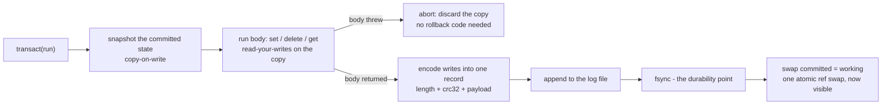

# Reliability — the durability contract, precisely

Durability is the trust-critical promise, so it is stated here with its exact scope — the guarantee,
the failure modes outside it, and how each one is handled. The crash/recovery path is proven with
**deterministic simulation testing (DST)** — the write-ahead log tortured under a seeded, in-memory
simulated filesystem — plus IO-fault injection and a binary fuzz suite.

## The contract

**On a healthy disk, a `transact()` that returns has been fsync'd and survives a crash.** A crash can
only ever damage the last, un-fsync'd record; recovery detects it (length framing + CRC-32), truncates
it away, and reports the truncation through the `onRecovery` open option — never silently more than
that one record.

The failure modes *outside* the clean-crash model are handled explicitly rather than assumed away:

- **A failed append or fsync (ENOSPC, EIO) latches the database.** The tail of the log may hold a torn
  record, so every later `transact()` throws (`code: "FAILED"`) until the file is closed and reopened —
  reopening repairs the tail. Without the latch, later "successful" commits would sit behind the torn
  record and be silently destroyed by the next recovery. Never assume a write after a failed fsync is
  safe (the "fsyncgate" lesson).
- **A second writer is refused.** `open({ path })` takes an exclusive lock (`<path>.lock`, holder
  pid/host recorded); a second open — same process or another — throws `code: "LOCKED"` instead of
  silently diverging two in-memory stores over one log. A lock whose holder is verifiably dead is
  reclaimed automatically.
- **A file that is not a LibreDB database is refused, untouched.** New databases carry an `LRDB`
  magic/version header; a foreign file (a typo'd path) throws `code: "NOT_A_DATABASE"` and is left
  byte-for-byte intact. Headerless files written by v0.1.x still open through a legacy read path.
- **Mid-log corruption refuses to open.** A record that fails its checksum with intact records *after*
  it cannot be a crash artifact (only the final append can tear) — it is damage to once-durable bytes
  (bit rot, a partial copy). Recovery throws `code: "CORRUPT_WAL"` and truncates nothing, preserving
  the evidence and the committed records behind it. One honest limitation: corruption that hits a
  record's *length field* on the final record is byte-for-byte indistinguishable from a torn tail in
  format v1 and truncates like one.
- **A short read is an IO fault, not missing data.** If the filesystem returns fewer bytes than the
  file holds, recovery throws (`code: "INCOMPLETE_READ"`) instead of mistaking the cut for a torn tail
  and truncating committed transactions.
- **Creating a database fsyncs the parent directory** (POSIX does not make a new directory entry
  durable until then), and a recovery truncation is itself fsync'd. On platforms without directory
  fsync (Windows), new-file entry durability is the OS's best effort.
- **In the browser (OPFS), the durability point is `flush()`**, which may be weaker than a POSIX
  `fsync` against power loss — see [`BROWSER.md`](./BROWSER.md).

## How it works

The kernel reaches the disk only through an injectable FS seam (`open({ path, fs })`), so a test can
run the real engine on a `SimFS` that crashes on command, tears the un-fsync'd tail at a seeded point,
and injects CRC corruption or short reads.

Every run is driven by one integer seed and a seeded workload of `set` / `delete` / `transact`
operations. After the crash and reopen, recovery must reproduce **a valid committed prefix** of the
workload — every transaction that returned successfully, and never a torn or un-committed one. An
independent committed-map model (sharing no code with the engine) is the oracle the recovered state is
compared against.

Beyond clean crashes, the suite injects the IO faults the contract above names: an append that
persists only a torn prefix then throws, an fsync that throws, short reads, mid-log corruption, and
multi-cycle crash-recover-write schedules — asserting in each case that acknowledged commits survive
and the database latches instead of appending past damage. A separate seeded fuzz drives binary keys
and values (the full byte alphabet, empty and multi-KB payloads) through commit/crash/recovery and
asserts the recovered store is exactly the model and strictly sorted.

## Running it

The DST suite runs as part of the normal gate:

```sh
bun run test            # runs a bounded 50 seeds (fast, CI-friendly)
```

Run a longer soak by raising the seed count (and optionally the base seed):

```sh
LIBREDB_DST_SEEDS=5000 bun test src/sim/dst.test.ts
LIBREDB_DST_BASE=1000000 LIBREDB_DST_SEEDS=5000 bun test src/sim/dst.test.ts
```

## Replaying a failure

When a seed fails, the suite prints the exact replay hint — `Replay with runSeed(<seed>)`. Because
everything is seed-driven, one seed reproduces the whole run byte-for-byte:

```ts
import { runSeed } from "./src/sim/dst.ts";

const result = runSeed(42);
result.passed;     // true — recovered state is a valid committed prefix
result.recovered;  // Map of the recovered committed key-value state
result.expected;   // the model oracle's committed state
```

The DST harness lives in `src/sim/` and is excluded from the published package — it is test machinery,
not shipped code.

## The durability path, precisely

The on-disk file opens with an 8-byte header — the `LRDB` magic and a format version — which is what
lets `open()` refuse a file that is not a LibreDB database instead of misreading (and damaging) it.
Each committed transaction is then a length-framed, CRC-32-checksummed redo record appended to that
single write-ahead log (there is no separate data file — the log *is* the database). The commit
sequence is: encode the transaction's writes into one record, append it to the log, `fsync`, and only
*then* swap the in-memory committed state to make the writes visible. The fsync happens before the
swap, so a `transact()` that has returned is on disk. If the append or fsync throws, the database
latches failed and the swap never happens — memory and disk stay on the prior state. On reopen the log
is replayed into an in-memory sorted array; a torn tail record (a crash mid-append) fails its
length/CRC check and is truncated away (and reported via `onRecovery`), leaving exactly the committed
prefix — while a bad record with intact records after it refuses the open as corruption.



For the full design rationale, see [`../ARCHITECTURE.md`](../ARCHITECTURE.md) sections 5 (durability)
and 9 (the IO seam and DST), and [`DESIGN.md`](./DESIGN.md).
