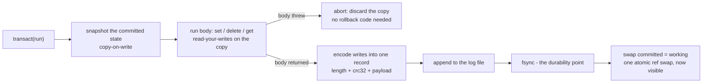

# Reliability — deterministic simulation testing

Durability is the trust-critical promise: a transaction that returns has been fsync'd, and a crash can
only ever damage the last, un-fsync'd record. LibreDB proves this with **deterministic simulation
testing (DST)** — the write-ahead log's crash/recovery path is tortured under a seeded, in-memory
simulated filesystem.

## How it works

The kernel reaches the disk only through an injectable FS seam (`open({ path, fs })`), so a test can
run the real engine on a `SimFS` that crashes on command, tears the un-fsync'd tail at a seeded point,
and injects CRC corruption or short reads.

Every run is driven by one integer seed and a seeded workload of `set` / `delete` / `transact`
operations. After the crash and reopen, recovery must reproduce **a valid committed prefix** of the
workload — every transaction that returned successfully, and never a torn or un-committed one. An
independent committed-map model (sharing no code with the engine) is the oracle the recovered state is
compared against.

## Running it

The DST suite runs as part of the normal gate:

```sh
bun run test            # runs a bounded 50 seeds (fast, CI-friendly)
```

Run a longer soak by raising the seed count (and optionally the base seed):

```sh
LIBREDB_DST_SEEDS=5000 bun test src/sim/dst.test.ts
LIBREDB_DST_BASE=1000000 LIBREDB_DST_SEEDS=5000 bun test src/sim/dst.test.ts
```

## Replaying a failure

When a seed fails, the suite prints the exact replay hint — `Replay with runSeed(<seed>)`. Because
everything is seed-driven, one seed reproduces the whole run byte-for-byte:

```ts
import { runSeed } from "./src/sim/dst.ts";

const result = runSeed(42);
result.passed;     // true — recovered state is a valid committed prefix
result.recovered;  // Map of the recovered committed key-value state
result.expected;   // the model oracle's committed state
```

The DST harness lives in `src/sim/` and is excluded from the published package — it is test machinery,
not shipped code.

## The durability path, precisely

Each committed transaction is written as a length-framed, CRC-32-checksummed redo record appended to a
single write-ahead log (there is no separate data file — the log *is* the database). The commit
sequence is: encode the transaction's writes into one record, append it to the log, `fsync`, and only
*then* swap the in-memory committed state to make the writes visible. The fsync happens before the
swap, so a `transact()` that has returned is on disk. On reopen the log is replayed into an in-memory
sorted array; a torn or corrupt tail record (a crash mid-append) fails its length/CRC check and is
truncated away, leaving exactly the committed prefix.



For the full design rationale, see [`../ARCHITECTURE.md`](../ARCHITECTURE.md) sections 5 (durability)
and 9 (the IO seam and DST), and [`DESIGN.md`](./DESIGN.md).
